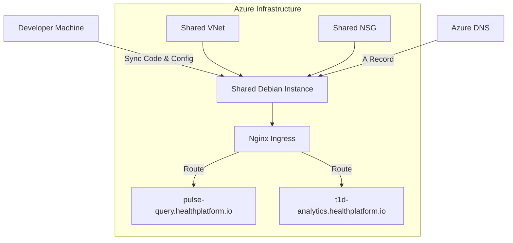

# Deployment Guide

Before running these commands, export the LibScript path:
```bash
export LIBSCRIPT_ROOT_DIR="~/repos/libscript"
```

This guide covers how to deploy the application to Azure using LibScript. You can either use the automated orchestration command or manually provision the infrastructure step-by-step (useful if you want to share a single node between multiple applications).

## 1. Automated Orchestration (Standalone Node)

The `provision` command automatically handles creating the VNet, NSG, VM, syncing the code, resolving dependencies, and daemonizing the application.

```bash
# Provision the stack on Azure (creates vm-t1d-analytics)
$LIBSCRIPT_ROOT_DIR/libscript.sh provision azure vm-t1d-analytics rg-analytics-prod eastus ./ t1d-analytics

# Map the domain to the newly provisioned node
$LIBSCRIPT_ROOT_DIR/libscript.sh azure dns map-node vm-t1d-analytics rg-analytics-prod t1d-analytics.healthplatform.io healthplatform-zone
```

### Automated Deprovisioning

To completely tear down the application and its infrastructure (including DNS A-records, OS Disks, and Network Interfaces):

```bash
$LIBSCRIPT_ROOT_DIR/libscript.sh deprovision azure vm-t1d-analytics rg-analytics-prod eastus ./ t1d-analytics
```

---

## 2. Manual Orchestration (Shared Node)

If you want to host multiple applications on the same VM, you can manually provision the infrastructure and then deploy the codebases to the shared node.

### Step 0: Create the Network
Create a virtual network for the node.
```bash
$LIBSCRIPT_ROOT_DIR/libscript.sh azure network create shared-vnet rg-analytics-prod --location eastus
```

### Step 1: Create the Firewall (NSG)
Create a network security group to open necessary ports (e.g., SSH, HTTP, HTTPS).
```bash
$LIBSCRIPT_ROOT_DIR/libscript.sh azure firewall create shared-nsg rg-analytics-prod "22 80 443" --location eastus
```

### Step 2: Provision the Instance
Create the Debian instance attached to your network and firewall.
```bash
$LIBSCRIPT_ROOT_DIR/libscript.sh azure node create shared-node Debian:debian-12:12-gen2:latest rg-analytics-prod --size Standard_B2s --vnet-name shared-vnet --nsg shared-nsg
```

### Step 3: Deploy the Code
Sync your current working directory to the instance (respecting .gitignore).
```bash
$LIBSCRIPT_ROOT_DIR/libscript.sh azure node deploy shared-node rg-analytics-prod ./ t1d-analytics
```

### Step 4: Map DNS and Start Stack
Map your domain and trigger the remote installation and daemonization.
```bash
# Map DNS
$LIBSCRIPT_ROOT_DIR/libscript.sh azure dns map-node shared-node rg-analytics-prod t1d-analytics.healthplatform.io healthplatform-zone

# Install dependencies and start the stack on the remote node
$LIBSCRIPT_ROOT_DIR/libscript.sh azure node exec shared-node rg-analytics-prod "cd t1d-analytics && sudo ~/libscript/libscript.sh install-deps"
$LIBSCRIPT_ROOT_DIR/libscript.sh azure node exec shared-node rg-analytics-prod "cd t1d-analytics && sudo ~/libscript/libscript.sh start"
```

### Manual Teardown

If you deployed manually, you can delete the resources manually:

```bash
# Unmap DNS
$LIBSCRIPT_ROOT_DIR/libscript.sh azure dns unmap-node shared-node rg-analytics-prod t1d-analytics.healthplatform.io healthplatform-zone

# Delete Node, NSG, and VNet
$LIBSCRIPT_ROOT_DIR/libscript.sh azure node delete shared-node rg-analytics-prod
$LIBSCRIPT_ROOT_DIR/libscript.sh azure firewall delete shared-nsg rg-analytics-prod
$LIBSCRIPT_ROOT_DIR/libscript.sh azure network delete shared-vnet rg-analytics-prod
```

## Deployment Architecture




## HTTPS / TLS Provisioning

LibScript natively configures HTTPS for your mapped domains. This is governed by the `libscript.json` configuration file present in your repository.

```json
{
  "ingress": {
    "tls": "letsencrypt"
  }
}
```

When you invoke the `start` command on the remote node, the framework detects the `domain` and `tls` blocks and automatically uses `certbot` to provision and bind a Let's Encrypt certificate to the generated Nginx reverse proxy. No manual intervention or certificate renewal scripts are required.

## Multi-Environment / Multi-Tenant Deployments

You can easily deploy multiple instances of the same stack (e.g., an `alpha` version and a `prod` version) to the *same* shared node under different domains.

### 1. Distinct Deployment Directories
When syncing your code, ensure you use distinct destination paths on the remote node to prevent overwriting your existing environments.

```bash
# Deploy Alpha version
$LIBSCRIPT_ROOT_DIR/libscript.sh azure node deploy shared-node rg-analytics-prod ./ t1d-analytics-alpha

# Deploy Production version
$LIBSCRIPT_ROOT_DIR/libscript.sh azure node deploy shared-node rg-analytics-prod ./ t1d-analytics-prod
```

### 2. Environment-Specific DNS Mapping
Map your distinct environments to different subdomains.

```bash
# Map Alpha DNS
$LIBSCRIPT_ROOT_DIR/libscript.sh azure dns map-node shared-node rg-analytics-prod alpha.t1d-analytics.healthplatform.io healthplatform-zone

# Map Production DNS
$LIBSCRIPT_ROOT_DIR/libscript.sh azure dns map-node shared-node rg-analytics-prod t1d-analytics.healthplatform.io healthplatform-zone
```

### 3. Updating the Remote Stack Configurations
Once deployed, modify the `libscript.json` inside the specific remote directory to reflect its intended domain before starting the stack. 

For the alpha environment on the shared node, you would edit `~/t1d-analytics-alpha/libscript.json`:
```json
{
  "domain": "alpha.t1d-analytics.healthplatform.io"
}
```

*(Note: If you have conflicting static ports in your `libscript.json`, be sure to alter the `ports` block or use dynamic `$PORT` environment variables so both the alpha and prod services can run concurrently on the same shared host).*

### 4. Daemonize
Navigate into the respective directories on the remote node and start the services.

```bash
$LIBSCRIPT_ROOT_DIR/libscript.sh azure node exec shared-node rg-analytics-prod "cd t1d-analytics-alpha && sudo ~/libscript/libscript.sh start"
$LIBSCRIPT_ROOT_DIR/libscript.sh azure node exec shared-node rg-analytics-prod "cd t1d-analytics-prod && sudo ~/libscript/libscript.sh start"
```

